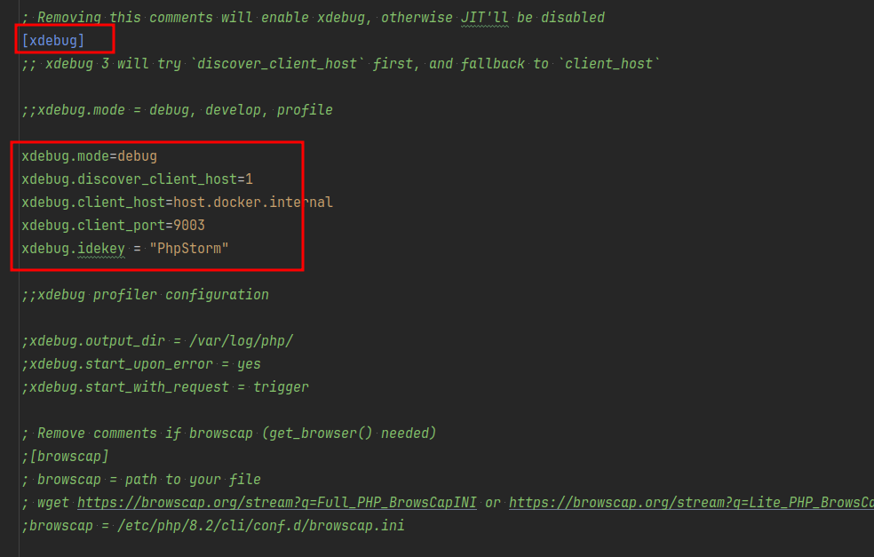
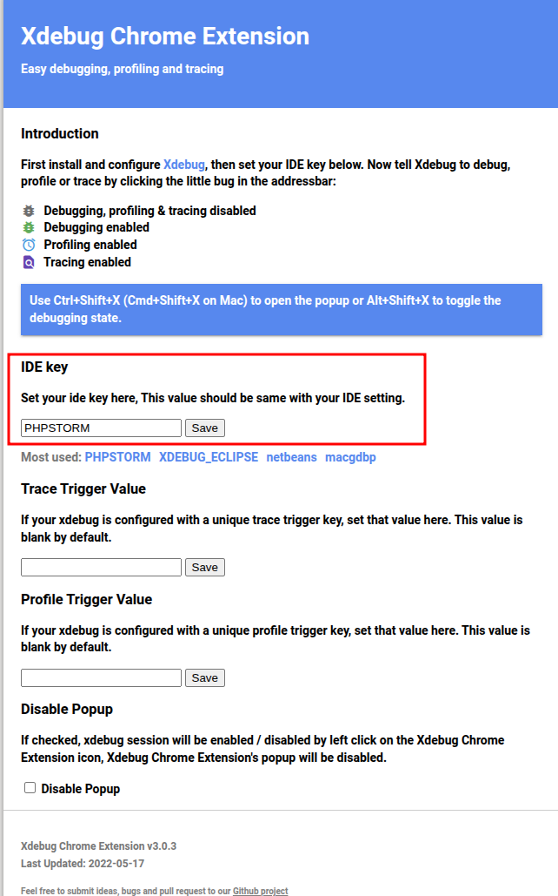
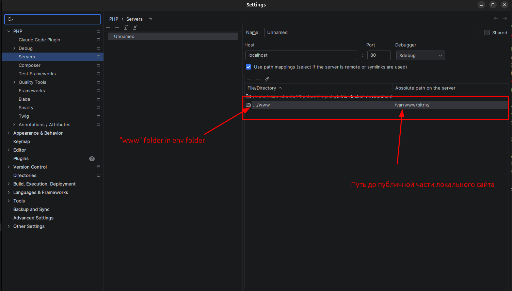

## Сборка, сделанная для моих нужд на основе bitrixdock. Вся основная документация тут: https://github.com/bitrixdock/bitrixdock

# Работа в Windows
1. Для корректной работы под Windows: клонируем проект внутрь файловой системы WSL -> запускаем docker compose up -d внутри WSL -> пользуемся
2. Для разработки в phpstorm (пользуюсь им) проект надо открывать именно внутри файловой системы WSL

# Какие есть сервисы
1. Nginx: открытые порты 80\443. Для локальной разработки используется порт 80
2. MYSQL: открытый порт 3306
3. XHProf Viewer: открытый порт 8888
4. Mailpit: открытые порты 1025\8025. Публичный интерфейс на порте 8025
5. PHP
6. Bitrix Push server (включается только в профиле push)
7. Redis (включается только в профиле push)
8. Memcached
9. CRON (см. папку cron)

# Быстрый старт
1. Скопировать .env.example в файл .env
2. docker compose up -d
3. Скачать файл восстановления битрикса или установки его же. Доступы в базу: адрес сервера db (название контейнера в сервисе), логин bitrix, пароль 123, база bitrix
4. Установить сайт, работать в папке www (будет создана автоматически)

# Как пользоваться xhprof
1. Взять содержимое xhprof_class и поместить его в место, где он будет всегда подгружен (например, dbconn.php)
2. ::startProfiling() ставим в месте, откуда начинаем делать трейс
3. ::saveProfile() ставим в конце блока кода, который отслеживаем
4. Заходим на http://localhost:8888 и выбираем нужный трейс, смотрим

# Как пользоваться makefile
1. Установить make
2. Пользоваться

# Как пользоваться mailpit
1. Открыть http://localhost:8025
2. Отправлять письма и смотреть их

# Где смотреть логи
1. В папке docker окружения будет создана папка logs
2. Логи битрикса можно смотреть и в папке с логами самого битрикса

# Как включить xdebug
1. Открыть docker/php/php82/php.ini (или другую версию php, которая нужна)
2. Раскомментировать выделенные строки, пересобрать контейнер с php 
3. Установить расширение xdebug для браузера
4. Настроить его как на скриншоте 
5. Настроить xdebug в шторме, сделать маппинг папки www на её линк в контейнере php 

